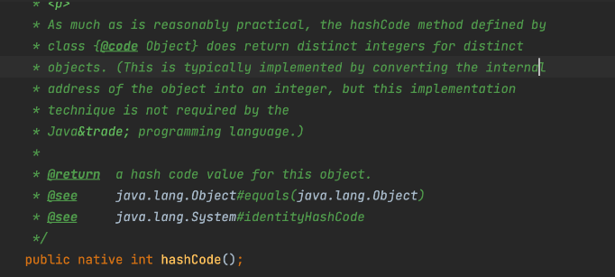
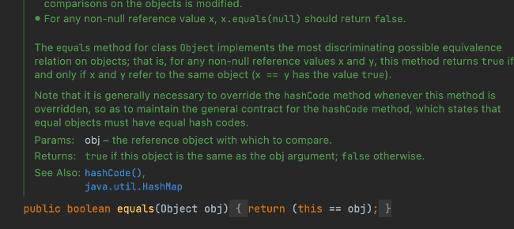

`hashCode、equals` 和 `==` 都是 `Java` 中用于比较对象的三种方式，但是它们的用途和实现还是有挺大区别的。

### hashCode

方法返回对象的哈希码（整数），主要用于支持基于哈希表的集合，用来确定对象的存储位置，如 `HashMap、HashSet` 等。

`Object` 类中的默认实现会根据对象的内存地址生成哈希码（`native` 方法）。

在 `Java` 中，`hashCode` 方法和 `equals` 方法有一个**通用合同**：
- 如果两个对象根据 `equals` 方法被认为是相等的，那么它们必须具有相同的哈希码。
- 如果两个对象具有相同的哈希码，它们并不一定相等，但会被放在同一个哈希桶中。

### equals

用于比较两个对象的内容是否相等。`Object` 类中的默认实现会使用 == 操作符来比较对象的内存地址。

通常我们需要在自定义类中重写 `equals` 方法，以基于对象的属性进行内容比较。比如你可以自定义两个对象的名字一样就是相等的、年龄一样就是相等，可以灵活按照需求定制。

如果两个对象的 `equals` 方法返回 `true，则它们的` `hashCode` 方法必须返回相同的值，反之则不需要。

对于 `equals` 定义的比较，实际上还有以下五个要求：

- 自反性：对于任何非空引用值 `x`，`x.equals(x)` 必须返回 `true`。
- 对称性：对于任何非空引用值 `x` 和 `y`，如果 `x.equals(y)` 返回 `true`，则 `y.equals(x)` 也必须返回 `true`。
- 传递性：对于任何非空引用值 `x`、`y` 和 `z`，如果 `x.equals(y)` 返回 `true` 且 `y.equals(z)` 返回 `true`，则 `x.equals(z)` 也必须返回 `true`。
- 一致性：对于任何非空引用值 `x` 和 `y`，只要对象在比较中没有被修改，多次调用 `x.equals(y)` 应返回相同的结果。
- 对于任何非空引用值 `x`，`x.equals(null)` 必须返回 `false`。

### ==

`==` 操作符用于比较两个引用是否指向同一个对象（即比较内存地址），如果是基本数据类型，`==` 直接比较它们的值。

### 区别总结

`hashCode` 用于散列存储结构中确定对象的存储位置。可用于快速比较两个对象是否不同，因为如果它们的哈希码不同，那么它们肯定不相等。

`equals` 用于比较两个对象的内容是否相等，通常需要重写自定义比较逻辑。

`==` 用于比较两个引用是否指向同一个对象（即内存地址）。对于基本数据类型，比较它们的值。