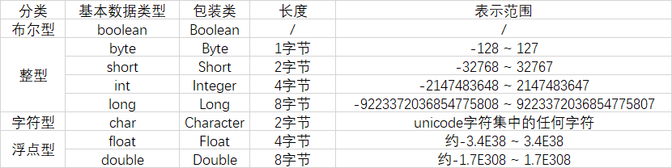

Java 中有 8 种基本数据类型，这些基本类型又有对应的包装类。

**因为 Java 是一种面向对象语言，很多地方都需要使用对象而不是基本数据类型**。比如，在集合类中，我们是无法将int 、double等类型放进去的。因为集合的容器要求元素是 Object类型。

为了让基本类型也具有对象的特征，就出现了包装类型，它相当于将基本类型“包装起来”，使得它具有了对象的性质，并且为其添加了属性和方法，丰富了基本类型的操作。

## 基本类型与包装类型的区别

1. **默认值不同**：基本类型的默认值是 0，false 等，包装类默认为 null
2. **初始化的方式不同**：一个需要采用 new 的方式创建，一个则不需要
3. **存储方式有所差异**：基本类型主要保存在栈上面，包装类对象保存在堆上（成员变量的话，在不考虑JIT优化的栈上分配时，都是随着对象一起保存在堆上的）