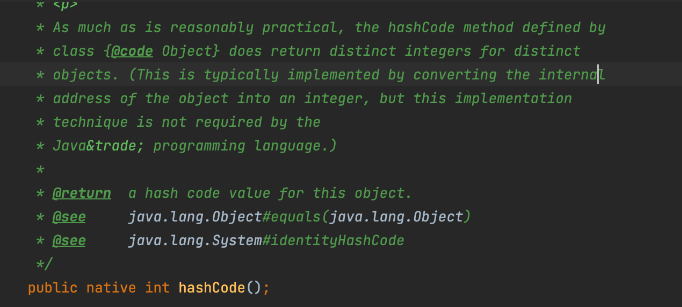
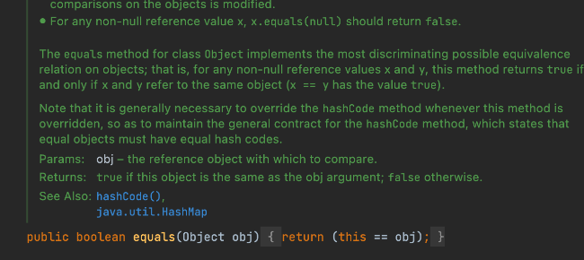

hashCode 是属于 Object 的一个方法，并且是个 native 方法，本质就是返回一个哈希码，即一个 int 值，一般是一个对象的内存地址转成的整数。


equals，我们知道是用来判断两个对象是否相同的，也是属于 Object 的一个方法，并且默认实现如下：



看到这，是不是觉得 hashCode 和 equals 没啥关系啊？为什么要放在一起说？

确实，一般情况下两者是没啥关系。但，如果是将一个对象用在散列表的相关类的时候，是有关系的。

比如 HashSet，我们常用来得到一个不重复的集合。

现在有个 Yes 类的 HashSet 集合，我只重写了 Yes 类的 equals 方法，表明如果 name 相同就返回 true。

```java
public boolean equals(Object obj) {
    if (this == obj) {
        return true;
    }
    if (obj instanceof Yes) {
        Yes other = (Yes) obj;
        return name.equals(other.name);
    }
    return false;
}
```

就重写一个 equals 的话，HashSet 中会出现相同 name 的 Yes 对象。

原因就是 hashCode 没有重写，那为什么会这样呢？因为 HashSet 是复用 HashMap 的能力存储对象，而塞入 key 的时候要计算 hash 值，可以看到这里实际会调用对象的 hashCode 方法来计算 hash 值。




然后在具体执行 putVal 方法的时候，相关的判断条件会先判断 hash 值是否相等，如果 hash 值都不同，那就认为这两个对象不相等，这与我们之前设定的 name 一样的对象就是相等的条件就冲突了，我们简单看下源码就清楚了：


可以看到，相关的判断条件都是先判断 hash 值，如果 hash 值相等，才会接着判断 equals。如果 hash 值不等，这个判断条件直接就 false 了。

因此规定，重写 equals 方法的时候，也要重写 hashCode 方法，这样才能保持条件判断的同步。我建议不管会不会用到散列表，只要你重写 equals 就一起重写 hashCode ，这样肯定不会出错。