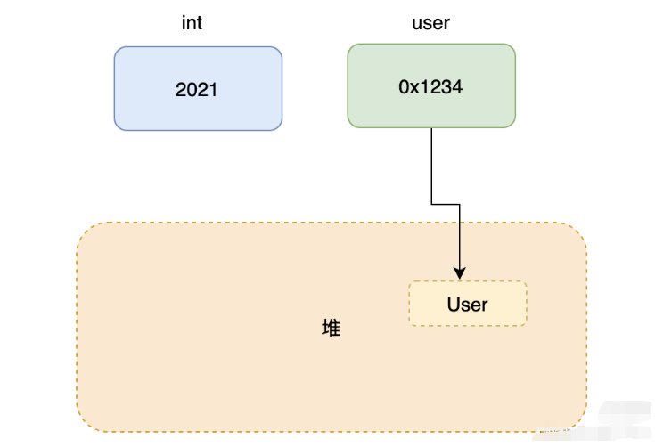

**Java 只有按值传递，不论是基本类型还是引用类型。**

基本类型是值传递很好理解，引用类型有些同学可能有点理解不了，特别是初学者。

JVM 内存有划分为栈和堆，局部变量和方法参数是在栈上分配的，引用类型占 4 个字节，基本类型看具体类型，例如 long 和 double 占 8 个字节。

而对象所占的空间是在堆中开辟的，引用类型变量存储对象在堆中地址来访问对象，所以传递的时候可以理解为把变量存储的地址给传递过去，因此引用类型也是值传递。

