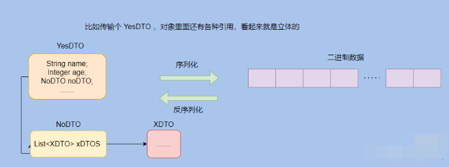
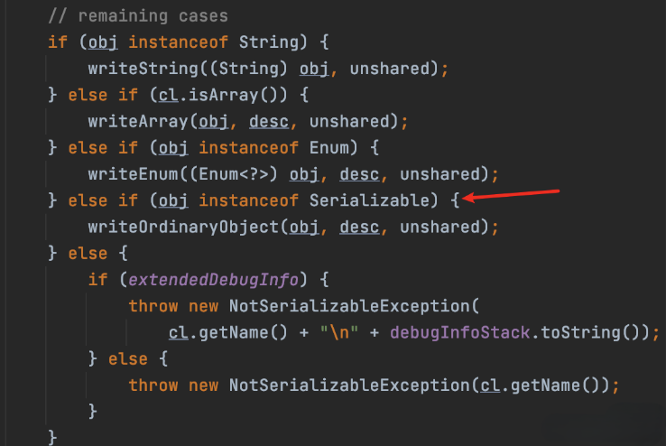
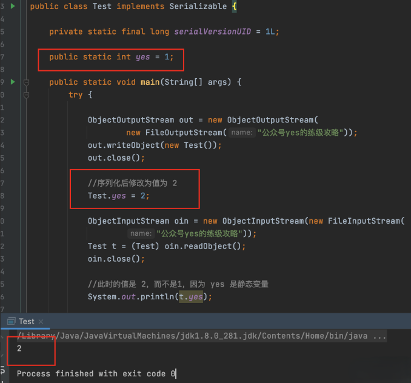

序列化其实就是将对象转化成可传输的字节序列格式，以便于存储和传输。

因为对象在 JVM 中可以认为是“立体”的，会有各种引用，比如在内存地址Ox1234 引用了某某对象，那此时这个对象要传输到网络的另一端时候就需要把这些引用“压扁”。

因为网络的另一端的内存地址 Ox1234 可以没有某某对象，所以传输的对象需要包含这些信息，然后接收端将这些扁平的信息再反序列化得到对象。

所以，**反序列化就是将字节序列格式转换为对象的过程**。

我再扩展一下 Java 序列化。

>首先说一下 Serializable，这个接口没有什么实际的含义，就是起标记作用。 

来看下源码就很清楚了，除了 String、数组和枚举之外，如果实现了这个接口就走 writeOrdinaryObject ，否则就序列化就抛错。

> serialVersionUID 又有什么用？

`private static final long serialVersionUID = 1L;`

想必经常会看到这样的代码，这个 ID 其实就是用来验证序列化的对象和反序列化对应的对象的 ID 是否是一致的。

所以这个 ID 的数字其实不重要，无论是 1L 还是 idea 自动生成的，只要序列化的时候对象的 serialVersionUID 和反序列化的时候对象的 serialVersionUID 一致的话就行。

如果没有显式指定 serialVersionUID ，则编译器会根据类的相关信息自动生成一个，可以认为是一个指纹。

所以如果你没有定义一个 serialVersionUID 然后序列化一个对象之后，在反序列化之前把对象的类的结构改了，比如增加了一个成员变量，则此时的反序列化会失败。

因为类的结构变了，生成的指纹就变了，所以 serialVersionUID 就不一致了。

所以 serialVersionUID 就是起验证作用。

> Java 序列化不包含静态变量

简单地说就是序列化之后存储的内容不包含静态变量的值，看一下下面的代码就很清晰了。

