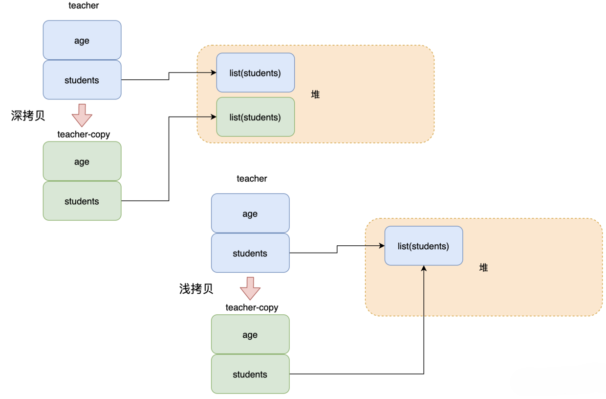

深拷贝：完全拷贝一个对象，包括基本类型和引用类型，堆内的引用对象也会复制一份。

浅拷贝：仅拷贝基本类型和引用，堆内的引用对象和被拷贝的对象共享。

所以假如拷贝的对象成员间有一个 list，深拷贝之后堆内有 2 个 list，之间不会影响，而浅拷贝的话堆内还是只有一个 list。

比如现在有个 teacher 对象，然后成员里面有一个 student 列表。

因此深拷贝是安全的，浅拷贝的话如果有引用对象则原先和拷贝对象修改引用对象的值会相互影响。