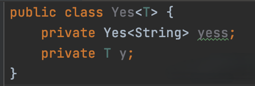
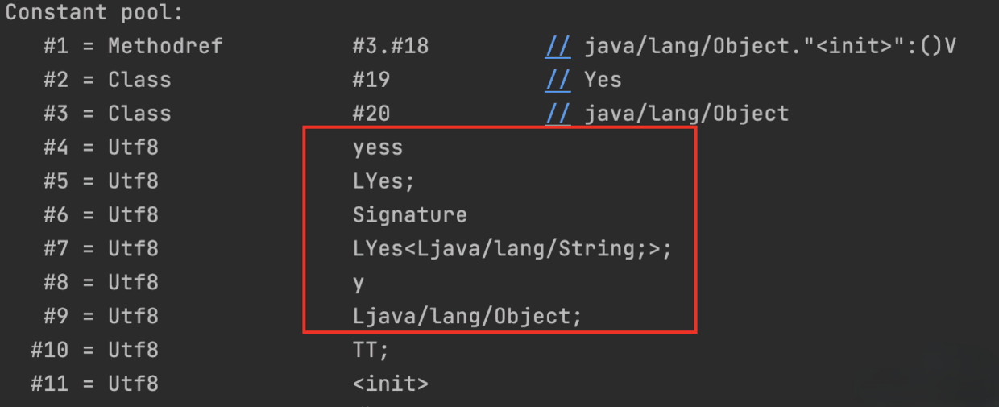

泛型可以把类型当作参数一样传递，使得像一些集合类可以明确存储的对象类型，不用显示地强制转化（在没泛型之前只能是Object，然后强转）。

并且在编译期能识别类型，类型错误则会提醒，增加程序的健壮性和可读性。

泛型擦除指的是参数类型在编译之后就被抹去了，也就是生成的 class 文件是没有泛型信息的，所以称之为擦除。

不过这个擦除有个细节，我们来看下代码就很清晰了，代码如下：

然后我们再来看看编译后的 class 文件。

以看到 yess 是有类型信息的，所以在代码里写死的泛型类型是不会被擦除的！

这也解释了为什么根据反射是可以拿到泛型信息的，因为这种写死的就没有被擦除！

至于泛型擦除是为了向后兼容，因为在 JDK 5 之前是没有泛型的，所以要保证 JDK 5 之前编译的代码可以在之后的版本上跑，而类型擦除就是能达到这一目标的一个实现手段。

其实 Java 也可以搞别的手段来实现泛型兼容，只是擦除比较容易实现。
